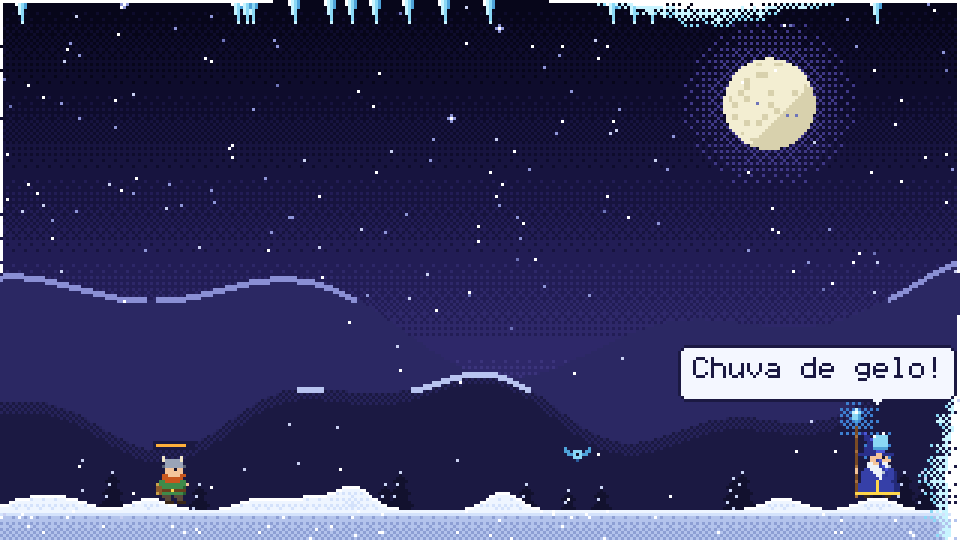

# snowlearner

A pixel-art frost mage lives on your desktop and slowly freezes your screen.
The only way to fight back: **speak the language you're learning.**


- 🧙 The **frost mage** patrols the bottom of the screen throwing ice, calls **icicle rain**,
  and summons **snowmen** and **penguins** that burst frost onto the screen edges.
- 🔥 Start a lesson and your **fire mage** teleports in. The frost mage asks the question;
  you answer out loud; get it right and a fireball melts part of the ice. 3 in a row call the **sun**.
- ⚔️ A **warrior** tries to survive: builds *fogueiras*, fights off frost slimes and bats,
  gives you tips (false friends, pronunciation traps) — and freezes solid if you ignore him.
- 🗣️ Lessons are **real situations** (meetings, travel, restaurant, doctor, phone, small talk…):
  new phrases you hear and repeat, known ones you must say **from memory**. Missed phrases come
  back until you get them. Recognizer slips of a letter or two don't count against you.
- 🌙 At the end of the day it shows and **reads back** everything you practiced.
- 🌀 A **magic orb** sits in a corner: click to practice, Ctrl+click for the panel,
  right-click to **pause** — everything gets sucked into a black hole until you're back.




No cloud, no LLM: voices are your OS's own, recognition is whisper.cpp running offline.
~4% of one CPU core and ~140 MB RAM while running (release build).

## Install

```sh
cargo install --path .                # or: cargo build --release
snowlearner model download            # ~142 MB offline speech model (once)
snowlearner shortcuts install         # GNOME/Wayland: registers the hotkeys
snowlearner doctor                    # what works on this machine, and how to fix the rest
snowlearner --mode overlay            # start (Linux Wayland defaults to a window)
```

Build dependencies: Rust ≥ 1.85, CMake and a C/C++ compiler (for whisper.cpp).
Linux also needs ALSA and libclang headers (`dnf install alsa-lib-devel clang-devel` /
`apt install libasound2-dev libclang-dev`) and, at runtime, `speech-dispatcher` or `espeak-ng`.
Build with `--no-default-features` to skip speech recognition (phrases are then confirmed with the hotkey).

## Use

| Action | Hotkey / mouse | Command |
|---|---|---|
| Practice a phrase / confirm / next | `Ctrl+Alt+M` · click the orb | `snowlearner say` |
| Control panel (language, level, topic, goal…) | `Ctrl+Alt+K` · Ctrl+click the orb | `snowlearner menu` |
| Pause (black hole) / resume | right-click the orb · `P` | `snowlearner pause` |
| Today's recap | `Ctrl+Alt+J` · `S` | `snowlearner summary` |
| Quit | — | `snowlearner quit` |
| Print a day's recap in the terminal | — | `snowlearner report [--date YYYY-MM-DD] [--speak]` |

Window mode extras: `H` help, `1`–`4` commitment, `L` switch language, click characters to poke them.

**Commitment level (*compromisso*)**: `chill | steady | committed | relentless` — how often the
mage attacks, summons and nudges you, and how much each answer melts (12–25%).

## Platforms

| | Windows | macOS | Linux X11 | Linux Wayland |
|---|---|---|---|---|
| Default display | transparent overlay | transparent overlay | transparent overlay | window (`--mode overlay` runs through XWayland) |
| Global hotkeys | ✓ | ✓ | ✓ | `snowlearner shortcuts install` (GNOME) or bind `snowlearner say/menu/summary` |
| Voice (TTS) | SAPI via PowerShell | `say` | `spd-say` / `espeak-ng` | same |
| Recognition | whisper.cpp | whisper.cpp | whisper.cpp | whisper.cpp |

Tested hands-on on Fedora 42 (GNOME Wayland); Windows and macOS build and pass tests in CI
(manual dispatch: `gh workflow run ci`).

## Configure

Everything is editable live in the panel; it's saved to `config.toml` (`snowlearner config path`):

```toml
learning = "en"          # "en" or "es" built in, or your own decks/<name>.toml
native = "pt-BR"
commitment = "steady"    # chill | steady | committed | relentless
practice = "auto"        # auto | repeat | recall
topic = ""               # "" = all, or e.g. "trabalho", "viagem"
max_level = "B2"         # A1..C2
daily_goal = 10
mode = "auto"            # auto | window | overlay
summary_time = "21:00"   # automatic end-of-day recap
model = "base"           # tiny | base | small
```

### Your own phrases

Drop a deck at `<config>/decks/en.toml` (it overrides the built-in one):

```toml
language = "en"
native = "pt-BR"
language_name = "inglês"
title = "Trabalho"

[[tip]]
text = "Falso amigo: 'actually' é 'na verdade'."

[[phrase]]
topic = "trabalho"
level = "B1"
situation = "Você quer marcar uma reunião com o time."
say = "Let's schedule a meeting"
accept = ["Let's set up a meeting"]
meaning = "Vamos marcar uma reunião"
tip = "Schedule: 'skédjul' no americano."
```

The built-in decks combine hand-written phrases with the Lexicaster curriculum
(`node scripts/port-lexicaster.mjs ../learn-lang-game` regenerates `decks/*.lexicaster.toml`).

## Develop

```sh
make test          # unit + binary tests
make test-speech   # real speech recognition end-to-end (needs model + espeak-ng)
make lint          # rustfmt --check + clippy -D warnings (both feature sets)
make snapshot      # render the scene to snapshot.png without a window
```

See [`CLAUDE.md`](CLAUDE.md) for layout and conventions and [`docs/specs`](docs/specs) for specs.
