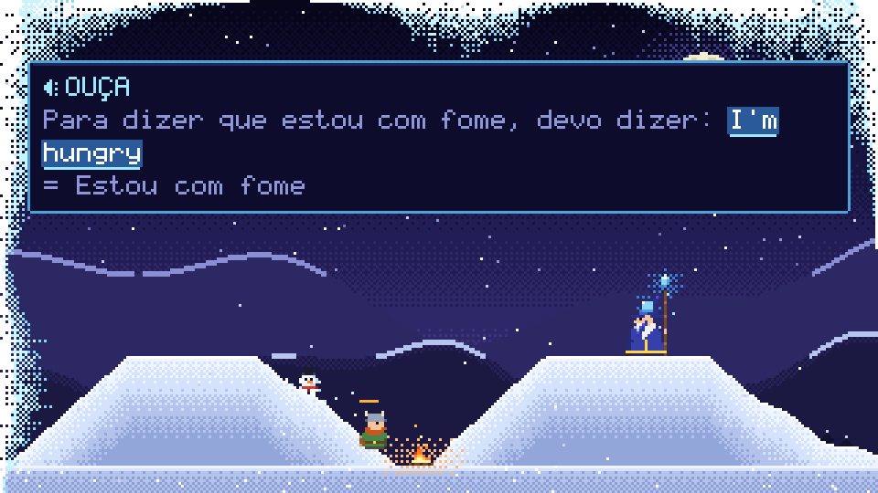

# snowlearner

A pixel-art frost mage lives on your desktop and slowly freezes your screen.
The only way to melt it: **speak the language you're learning.**



- 🧙 The **mage** patrols the bottom of the screen throwing ice cubes that pile up as snow,
  and now and then summons a **snowman** or **penguin** that bursts frost onto the screen edges.
- ⚔️ A **warrior** tries to survive: he builds *fogueiras* that thaw the snow around him,
  gives you tips in pt-BR, and freezes solid if you ignore him for too long.
- 🗣️ Press the hotkey: the lesson cue is read aloud — Portuguese parts in a pt-BR voice,
  the target phrase in an English/Spanish voice — with captions highlighting what's being said.
  Say it back; the mic listens, a **local** recognizer checks it, and each word lights up green or red.
  Get it right and the screen melts.
- 🌙 At the end of the day it shows and **reads back** everything you practiced.

No cloud, no LLM: voices are your OS's own, recognition is whisper.cpp running offline.

## Install

```sh
cargo install --path .                # or: cargo build --release
snowlearner model download            # ~142 MB offline speech model (once)
snowlearner doctor                    # what works on this machine, and how to fix the rest
snowlearner                           # start
```

Build dependencies: Rust ≥ 1.85, CMake and a C/C++ compiler (for whisper.cpp).
Linux also needs ALSA and libclang headers (`dnf install alsa-lib-devel clang-devel` /
`apt install libasound2-dev libclang-dev`) and, at runtime, `speech-dispatcher` or `espeak-ng`.
Build with `--no-default-features` to skip speech recognition (phrases are then confirmed with the hotkey).

## Use

| Action | Hotkey (default) | Command |
|---|---|---|
| Start a phrase / confirm / next | `Ctrl+Alt+M` | `snowlearner say` |
| Today's recap | `Ctrl+Alt+J` | `snowlearner summary` |
| Cancel | `Esc` (window mode) | — |
| Quit | — | `snowlearner quit` |
| Print a day's recap in the terminal | — | `snowlearner report [--date YYYY-MM-DD] [--speak]` |

**Commitment level (*compromisso*)** sets how hard the mage pushes:
`--level chill | steady | committed | relentless` (or `commitment` in the config).
Higher levels throw faster, summon more often, nudge you more and melt less per phrase.

## Platforms

| | Windows | macOS | Linux X11 | Linux Wayland |
|---|---|---|---|---|
| Default display | transparent overlay | transparent overlay | transparent overlay | window (`--mode overlay` runs the overlay through XWayland) |
| Global hotkeys | ✓ | ✓ | ✓ | bind a desktop shortcut to `snowlearner say` — `doctor` prints the exact commands |
| Voice (TTS) | SAPI via PowerShell | `say` | `spd-say` / `espeak-ng` | same |
| Recognition | whisper.cpp | whisper.cpp | whisper.cpp | whisper.cpp |

Tested hands-on on Fedora 42 (GNOME Wayland); Windows and macOS are built and tested in CI.

## Configure

`snowlearner config init` writes `config.toml` (`snowlearner config path` shows where):

```toml
learning = "en"          # "en" or "es" built in, or your own decks/<name>.toml
native = "pt-BR"
commitment = "steady"    # chill | steady | committed | relentless
mode = "auto"            # auto | window | overlay
summary_time = "21:00"   # automatic end-of-day recap
match_threshold = 0.72   # how close your answer must be (0..1)
model = "base"           # tiny | base | small
```

### Your own phrases

Drop a deck at `<config>/decks/en.toml` (it overrides the built-in one):

```toml
language = "en"
native = "pt-BR"
title = "Trabalho"

[[phrase]]
say = "Let's schedule a meeting"
meaning = "Vamos marcar uma reunião"
cue = "Para sugerir uma reunião, diga: {}"   # {} = the phrase; {{text}} marks any target-language text
tip = "Schedule: 'skédjul' no americano."     # optional, the warrior uses it as a hint
```

## Develop

```sh
make test          # unit + binary tests
make test-speech   # real speech recognition end-to-end (needs model + espeak-ng)
make lint          # rustfmt --check + clippy -D warnings (both feature sets)
make snapshot      # render the scene to snapshot.png without a window
```

See [`CLAUDE.md`](CLAUDE.md) for layout and conventions and [`docs/specs`](docs/specs) for specs.
