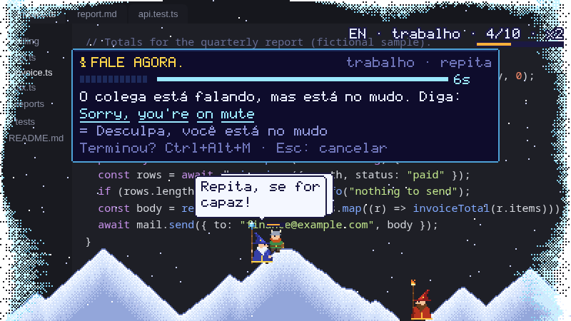
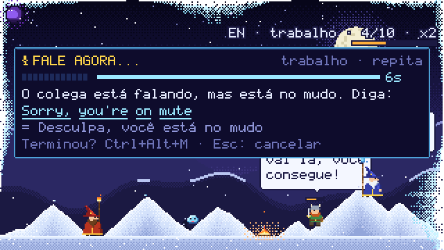
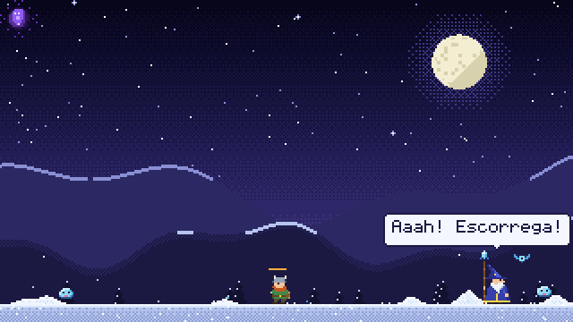
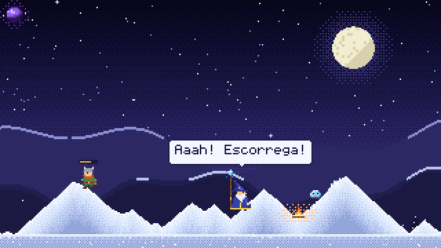

# snowlearner

A pixel-art frost mage lives on your desktop and slowly freezes your screen — right over
whatever you're working on. Snow piles up, then frost creeps in from the edges. The only way to
win your screen back: **speak the language you're learning.** Every answer you get right
melts some of it; ignore him and it only gets worse.



```sh
curl -fsSL https://raw.githubusercontent.com/AxeForging/snowlearner/main/install.sh | sh
```

That's it: it installs, downloads the offline speech model and registers the shortcuts.
Then open **Snowlearner** from your app menu (or run `snowlearner`). More in [Install](#install).

- 🧙 The **frost mage** patrols the bottom of the screen throwing ice, calls **icicle rain**,
  and summons **snowmen** and **penguins** that burst frost onto the screen edges. He asks the
  questions — and taunts you.
- 🔥 Start a lesson and your **fire mage** teleports in. Answer out loud; get it right and a
  fireball melts part of the ice. Three in a row call the **sun**.
- ⚔️ A **warrior** tries to survive: builds *fogueiras*, sword-fights frost slimes and bats,
  gives you tips (false friends, pronunciation traps) — and freezes solid if you ignore him.
- 🪜 You start from **zero**: first single words (*hello, water, thanks*), then short
  expressions (*good morning, the check please*), and only then full phrases — pre-A1 (no
  English at all) to B2. A few new items at a time; learning one opens the next, and it tells you so.
- 🗣️ Everything is a **real situation** (meetings, travel, restaurant, doctor, phone, small
  talk…): new items you hear and repeat, known ones you say **from memory**. Missed ones come
  back until you get them; a recognizer slip of a letter or two doesn't count against you.
- 📈 **Progress** (`Ctrl+Alt+P`): what you already know, what you're learning now and what
  comes next, per stage and per topic.
- 🎙️ It listens like a patient teacher: thinking time before you start, room to hesitate
  mid-sentence, a live mic meter, and your hotkey to say "done".
- 🔊 Voices: your OS's own, or **Kokoro** / any OpenAI-compatible TTS server, or any command
  (Piper…). Pick mics, speakers and voices — and test them — in the panel.
- 🌀 A **magic orb** sits in a corner: click to practice, Ctrl+click for the panel, right-click to
  **pause** — everything gets sucked into a black hole until you're back.
- ✋ Hold **Ctrl+Alt** (or `snowlearner grab`) and a magic hand lets you pick the mage (grumpy)
  or the warrior (shy) up and drop them in the snow.
- 🌙 At the end of the day it shows and **reads back** everything you practiced.

| A lesson (window mode) | Icicle rain, summons, mobs | Pause = black hole |
|---|---|---|
|  |  |  |

No cloud, no LLM required: recognition is whisper.cpp running offline.
**No GPU needed**: everything is drawn on the CPU and blitted to the window, redrawing only
what changed. About 2–3% of one CPU core and ~30 MB RAM while running (release build; the
speech model adds ~150 MB during a lesson and is freed 2 minutes after).

## Install

**Linux (x86_64) and macOS (Apple Silicon):**

```sh
curl -fsSL https://raw.githubusercontent.com/AxeForging/snowlearner/main/install.sh | sh
curl -fsSL https://raw.githubusercontent.com/AxeForging/snowlearner/main/install.sh | sh -s -- --lang es   # Spanish
```

**Windows (PowerShell):**

```powershell
irm https://raw.githubusercontent.com/AxeForging/snowlearner/main/install.ps1 | iex
```

The installer downloads the latest [release](https://github.com/AxeForging/snowlearner/releases),
checks its SHA-256, puts `snowlearner` in `~/.local/bin` (Windows: your user programs + PATH +
Start menu) and runs `snowlearner setup`, which is safe to run again any time:

- writes the config (`--lang en|es`), downloads the ~142 MB offline speech model (`--no-model` skips it),
- registers the shortcuts on GNOME, adds Snowlearner to the app menu (Linux).

Then start it from the app menu or with `snowlearner`. `snowlearner doctor` tells you what works
on your machine and how to fix the rest; started from the menu, the app logs to `snowlearner.log`
(`snowlearner config path`). Linux needs a voice installed for the app to talk
(`speech-dispatcher` or `espeak-ng`, present on most desktops). No GPU required.

**From source:** `cargo install --git https://github.com/AxeForging/snowlearner`, then `snowlearner setup`.
Build dependencies: Rust ≥ 1.85, CMake and a C/C++ compiler (for whisper.cpp).
Linux also needs ALSA and libclang headers (`dnf install alsa-lib-devel clang-devel` /
`apt install libasound2-dev libclang-dev`) and, at runtime, `speech-dispatcher` or `espeak-ng`.
Feature flags: `stt` (default: mic + recognition), `audio` (devices + playback only),
`gpu` (default: only used for see-through windows on native Wayland/macOS),
none (hotkey confirms your answer, CPU-only drawing). `SNOWLEARNER_RENDERER=cpu|gpu` forces one.

## Use

| Action | Hotkey / mouse | Command |
|---|---|---|
| Practice a phrase · "I'm done talking" · next | `Ctrl+Alt+M` · click the orb | `snowlearner say` |
| Control panel (game, audio, progress tabs) | `Ctrl+Alt+K` · Ctrl+click the orb | `snowlearner menu` |
| Your progress: known · learning · next | `Ctrl+Alt+P` | `snowlearner progress` (`--print` in the terminal) |
| Magic hand (15 s) | hold `Ctrl+Alt` · `Ctrl+Alt+G` | `snowlearner grab` |
| Pause (black hole) / resume | right-click the orb · `P` | `snowlearner pause` |
| Today's recap | `Ctrl+Alt+J` · `S` | `snowlearner summary` |
| Shortcut cheat sheet | hover the orb · hold `Ctrl+Alt` | — |
| Quit | — | `snowlearner quit` |

Window mode extras: `H` help, `1`–`4` commitment, `L` switch language, click characters to poke them.

**Commitment level (*compromisso*)**: `chill | steady | committed | relentless` — how often the
mage attacks, summons and nudges you, and how much each answer melts (12–25%).

## Audio & voices

```sh
snowlearner audio mics            # list microphones (* = configured)
snowlearner audio speakers
snowlearner audio test-mic        # live meter, then shows what the recognizer heard
snowlearner voices list --lang pt-BR
snowlearner voices test --lang en --voice af_heart
```

Or open the panel's **ÁUDIO** tab: microphone, *Testar microfone*, voice engine, *Endereço* (TTS
server, e.g. `192.168.0.10:8880`), pt-BR voice, target-language voice, *Testar vozes*, speaker.
Changes apply live and are saved.

**Voice engines** (`tts_engine`):

| engine | what | config |
|---|---|---|
| `system` | OS voices: spd-say/espeak-ng, macOS `say`, Windows SAPI | — |
| `http` | any OpenAI-compatible server, e.g. [Kokoro-FastAPI](https://github.com/remsky/Kokoro-FastAPI) — natural pt-BR/en/es voices | `tts_url = "http://localhost:8880/v1"`, `tts_model = "kokoro"` |
| `command` | anything else: `{text}` `{lang}` `{voice}` `{out}` placeholders, run without a shell | `tts_command = "piper --model pt_BR.onnx --output_file {out}"` |

New engines implement one trait (`speech::voices::SpeechEngine`: describe / available / voices /
speak) and get device choice, playback, the panel pickers and the CLI for free.

**How listening works:** the mic ignores the first 250 ms (echo of the voice), gives you 6 s to start
(10 s when recalling from memory — `listen_seconds` tunes it), calibrates on the quietest moments,
lets you pause ~1.8 s mid-phrase until you've said roughly what's expected, and caps the turn
relative to when you started. Stock whisper hallucinations ("Thank you for watching") count as silence.

## Platforms

| | Windows | macOS | Linux X11 | Linux Wayland |
|---|---|---|---|---|
| Default display | transparent overlay | transparent overlay | transparent overlay | window (`--mode overlay` runs through XWayland) |
| Global hotkeys | ✓ | ✓ | ✓ | `snowlearner setup` registers them (GNOME), or bind `snowlearner say/menu/summary/grab/progress` |
| Hold Ctrl+Alt (cheat sheet, hand) | ✓ | ✓ | ✓ | hover the orb / `Ctrl+Alt+G` |
| Voice (system) | SAPI via PowerShell | `say` | `spd-say` / `espeak-ng` | same |
| Recognition | whisper.cpp | whisper.cpp | whisper.cpp | whisper.cpp |

Tested hands-on on Fedora 42 (GNOME Wayland) and Windows 11; macOS binaries are built by the
release workflow on every `v*` tag (CI itself runs on Linux: `gh workflow run ci`).

## Configure

Everything is editable live in the panel; it's saved to `config.toml` (`snowlearner config path`):

```toml
learning = "en"          # "en" or "es" built in, or your own decks/<name>.toml
native = "pt-BR"
commitment = "steady"    # chill | steady | committed | relentless
practice = "auto"        # auto | repeat | recall
topic = ""               # "" = all, or e.g. "trabalho", "viagem"
max_level = "B2"         # PRE-A1 | A1..C2
daily_goal = 10
listen_seconds = 6.0     # time to start answering (recall gets +4)
mic = ""                 # "" = system default (see `snowlearner audio mics`)
speaker = ""
tts_engine = "system"    # system | http | command
voice_native = ""        # "" = automatic
voice_learning = ""
mode = "auto"            # auto | window | overlay
summary_time = "21:00"
model = "base"           # tiny | base | small
```

### Your own phrases

Drop a deck at `<config>/decks/en.toml` (it overrides the built-in one):

```toml
language = "en"
native = "pt-BR"
language_name = "inglês"
title = "Trabalho"

[[tip]]
text = "Falso amigo: 'actually' é 'na verdade'."

[[phrase]]
topic = "trabalho"
level = "B1"
situation = "Você quer marcar uma reunião com o time."
say = "Let's schedule a meeting"
accept = ["Let's set up a meeting"]
meaning = "Vamos marcar uma reunião"
tip = "Schedule: 'skédjul' no americano."
```

The built-in decks combine hand-written phrases, the first words and expressions
(`decks/<lang>.basics.toml`) and the Lexicaster curriculum
(`node scripts/port-lexicaster.mjs ../learn-lang-game` regenerates `decks/*.lexicaster.toml`).

## Develop

```sh
make test               # unit + binary tests
make test-speech        # real speech recognition end-to-end (needs model + espeak-ng)
make lint               # rustfmt --check + clippy -D warnings (all feature sets)
scripts/render-docs.sh  # re-render the README clips (animated WebP) from the real scene
```

See [`CLAUDE.md`](CLAUDE.md) for layout and conventions and [`docs/specs`](docs/specs) for specs.
